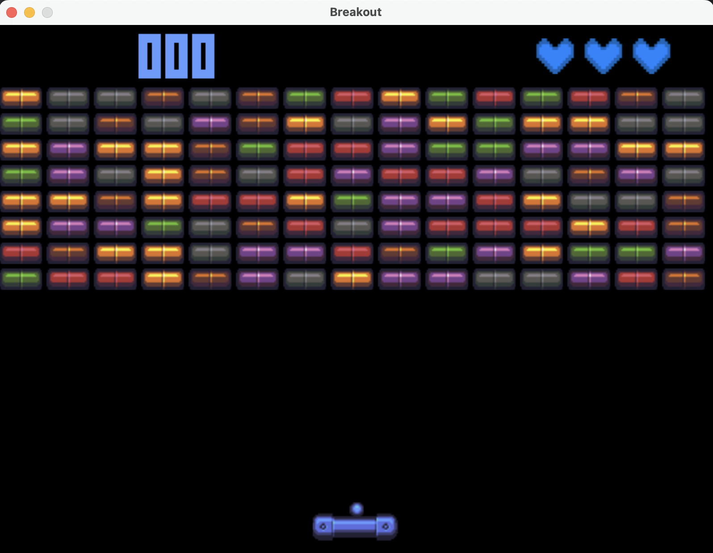

# Breakout Game

## Overview
This is a simple Breakout game created using **Pygame**. The objective is to break all the bricks by bouncing a ball off a paddle.
You can find more information about this iconic game on [Wikipedia](https://en.wikipedia.org/wiki/Breakout_(video_game)).

## Installation
1. Make sure you have Python and Pygame installed on your system.
2. Download the game files.
3. Place the graphics (`paddle.png`, `ball.png`, `brick_{color}.png`, `heart.png`) in a folder named `graphics`.
4. Ensure the font file `Pixeltype.ttf` is in a folder named `font`.
5. Run `main.py` using Python.

## Game Controls
- **Left Arrow:** Move paddle left
- **Right Arrow:** Move paddle right
- **Spacebar:** Launch the ball

## Gameplay
The game starts with three lives. Each time the ball hits the paddle, it bounces back. If the ball falls below the paddle, you lose a life. The game ends when all lives are lost.  
Bricks are randomly colored and disappear when hit by the ball, contributing to your score. After clearing all bricks, a new level starts, increasing the ball's speed.

## Customizing the Game
You can customize the game by modifying the graphics, adjusting the paddle speed, ball speed, or even changing the layout of bricks in the `create_brick_grid` function.

## License
This game is open source. Feel free to modify and share it as you wish!